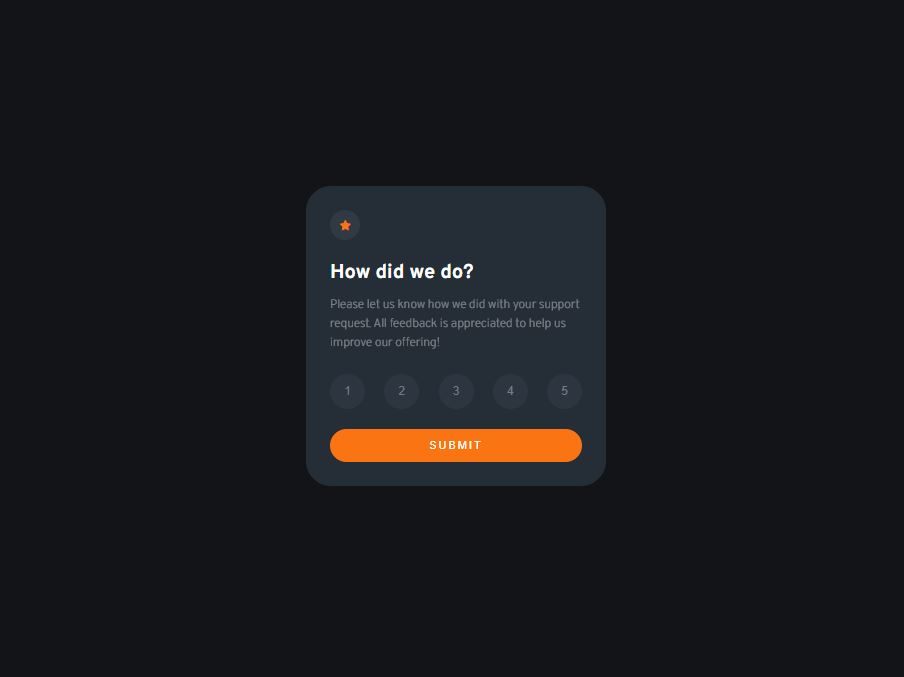

# Rude Rating Component

This is a modified version of the Rating Component I created from frontendmentor.io.

## Table of contents

- [Overview](#overview)
  - [The project](#the-project)
  - [Screenshot](#screenshot)
  - [Links](#links)

## Overview

### The project

I decided to have a bit of fun by displaying a different rude confirmation of rating for each number out of 5. I also experimented with transitions/animations on emoji icons.

### Screenshot

### Links

- Solution URL: [GitHub](https://github.com/Roneeey/RudeRatingWidget)
- Live Site URL: [GitHub Pages](https://roneeey.github.io/RudeRatingWidget/)
